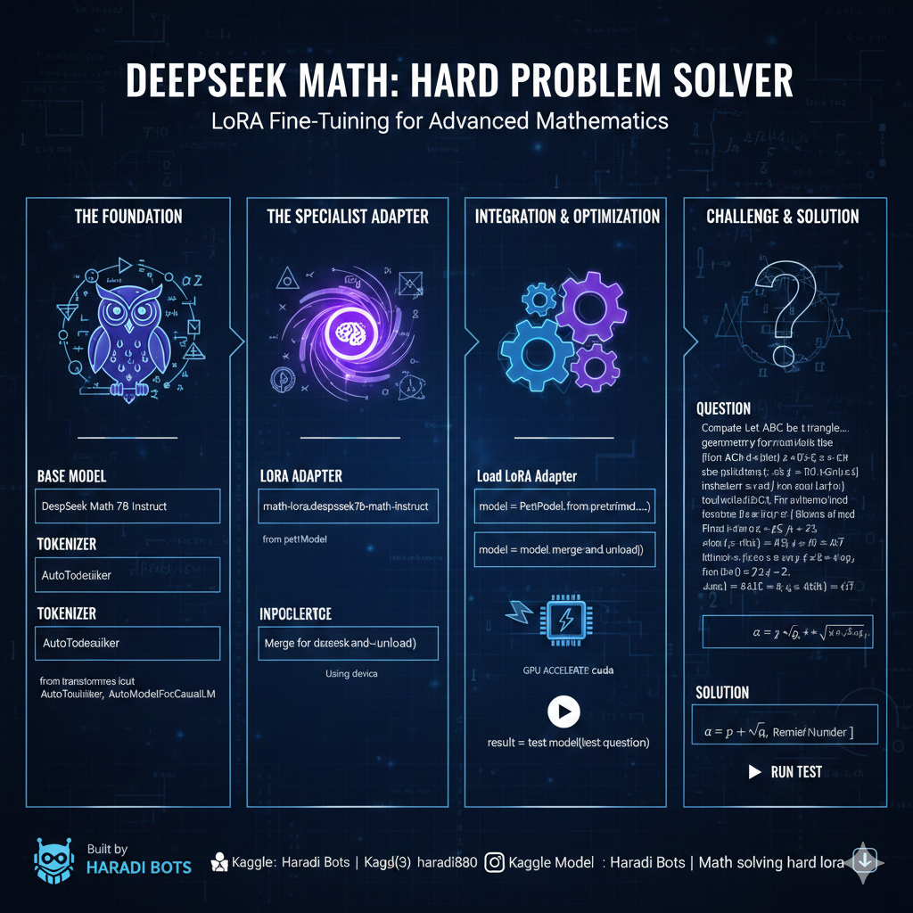

This code is an example of **fine-tuning** or **transfer learning** applied to a large language model (LLM), specifically the DeepSeek Math 7B Instruct model, using the **LoRA** (Low-Rank Adaptation) method. It loads a pre-trained base model, attaches a LoRA adapter trained on a specialized math dataset, and then uses the resulting model for complex math problem-solving.

Here is a comprehensive README for your project.

-----

#  DeepSeek Math 7B Instruct with Hard-Math LoRA Adapter



A robust setup for tackling extremely challenging competitive mathematics problems by combining the powerful DeepSeek Math 7B Instruct LLM with a specialized Low-Rank Adaptation (LoRA) adapter.

##  Overview

This project demonstrates how to load a foundational large language model, the **DeepSeek Math 7B Instruct**, and integrate a custom-trained **LoRA adapter** to enhance its performance on difficult, advanced mathematical tasks. The script handles model and tokenizer loading, LoRA integration, model merging for efficient inference, and provides a testing function for immediate evaluation.

The fine-tuning was performed by Haradi Bots.

-----

## 🛠️ Requirements

The following Python packages are required. They can typically be installed via `pip`.

```bash
pip install torch transformers peft kagglehub
```

### Hardware Requirements

  * A **CUDA-enabled GPU** is highly recommended for running this model efficiently, as it utilizes `torch.bfloat16` precision and is a 7-billion parameter model.
  * The script defaults to `cpu` if no CUDA device is found, but inference will be significantly slower.

-----

## 📂 Project Structure and Configuration

The script relies on two main path variables for locating the model and adapter files.

| Variable | Description | Source |
| :--- | :--- | :--- |
| `BASE_MODEL_PATH` | Path to the DeepSeek Math 7B Instruct base model files. | `/kaggle/input/deepseek-math/pytorch/deepseek-math-7b-instruct/1` |
| `LORA_ADAPTER_PATH` | Path to the custom-trained LoRA adapter files. | `/kaggle/input/math-lora-deepeseek7b-math-instruct/transformers/default/1/lora_adapter` |

> **Note:** The current paths are set for a specific Kaggle environment. If running locally or on a different platform, these paths must be updated to the local file system paths where the model and adapter are stored.

## 📥 Model and Adapter Download

To run this code outside of its original Kaggle environment, you will need to download the necessary assets.

### 1\. Base Model

The DeepSeek Math 7B Instruct model can be obtained from its source (e.g., Hugging Face or the original Kaggle dataset).

### 2\. LoRA Adapter

The custom LoRA adapter is available on Kaggle Hub and can be downloaded using the `kagglehub` library:

```python
import kagglehub

# Download latest version of the LoRA adapter
path = kagglehub.model_download("haradibots/math-solving-hard-lora/transformers/default")

print("Path to downloaded model files (LoRA adapter):", path)
# Use the path returned here to update LORA_ADAPTER_PATH in the script.
```

-----

## 💻 Usage

### 1\. Running the Script

Simply execute the main Python script. It will:

1.  Detect the available device (`cuda` or `cpu`).
2.  Load the **base model** and **tokenizer**.
3.  Load the **LoRA adapter** and apply it to the base model using `PeftModel.from_pretrained`.
4.  **Merge** the LoRA weights into the base model weights for faster inference.
5.  Run the predefined complex math test case using the `test_model` function.

<!-- end list -->

```bash
python your_script_name.py
```

### 2\. Testing a Custom Question

You can easily modify the `if __name__ == "__main__":` block to test your own questions.

```python
if __name__ == "__main__":
    my_custom_question = "If $x^2 + y^2 = 25$ and $x + y = 7$, find the value of $x^3 + y^3$."
    
    result = test_model(my_custom_question)
    print("\nExtracted Solution:")
    print(result)
```

### 3\. Prompt Formatting

The `test_model` function uses the required prompt structure for the model:

```
Question:
{your_question}

Solution:
```

This is crucial for getting the intended solution-style output, as the model was likely fine-tuned with this specific format.

-----

## 🌐 Author and Project Links

| Platform | Link |
| :--- | :--- |
| **Kaggle** | [Haradi Bots | Kaggle](https://www.kaggle.com/haradibots) |
| **LoRA Model on Kaggle Hub** | [Haradi Bots | Math solving hard lora | Kaggle](https://www.google.com/search?q=https://www.kaggle.com/models/haradibots/math-solving-hard-lora) |
| **GitHub** | [https://github.com/haradi880](https://github.com/haradi880) |
| **Instagram** | [(3) Instagram](https://www.google.com/search?q=https://www.instagram.com/haradi880) |


## Haradibots - Aditya
**building a brain**